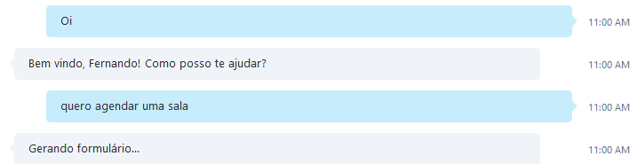

# Construindo Chat Bots com a plataforma Microsoft Bot Framework

Olá pessoal, meu nome é Fernando de Oliveira e neste artigo irei abordar o conceito de chat bots e mostrar como podemos desenvolver aplicações inteligentes para interagir com usuários de forma mais natural e humana. 

# O que é um chat bot?

Um chat bot é um programa que interage com usuários, simulando o comportamento humano em uma conversação (reagindo à comandos, perguntas e respostas). 
Um dos grandes desafios de um chat bots é ser um assistente para o usuário com conversações de forma mais natural possível.

