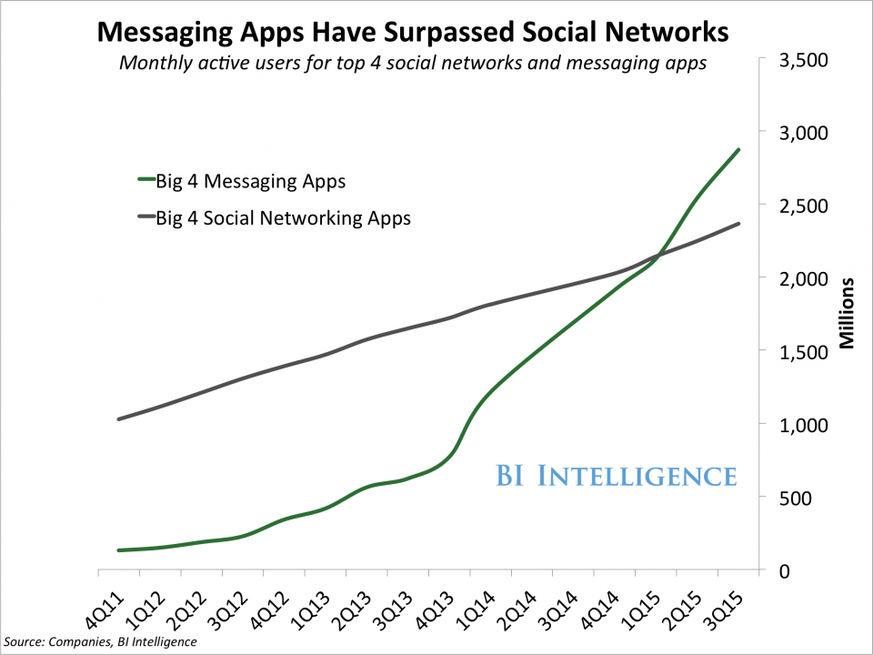
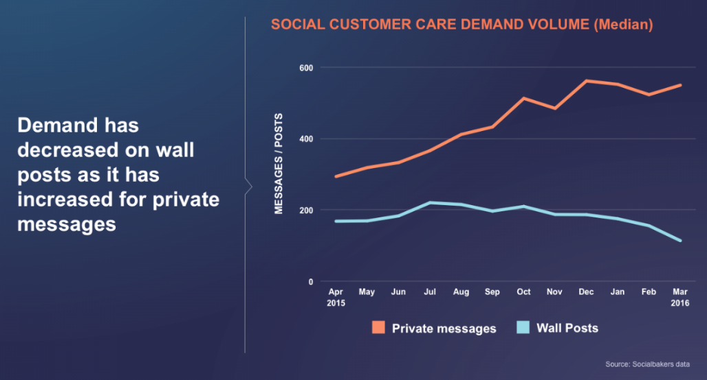
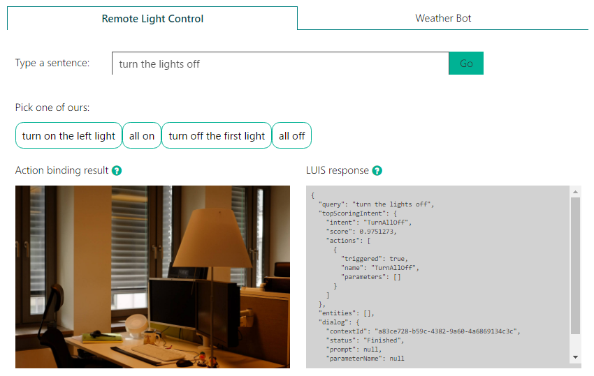
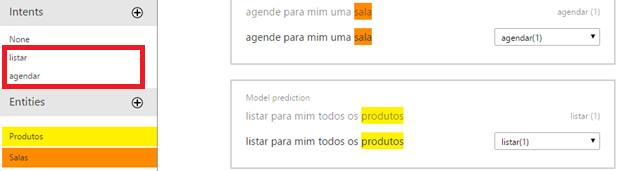
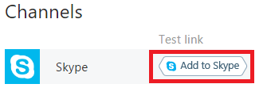

# Construindo Chat Bots com a plataforma Microsoft Bot Framework

Olá pessoal, meu nome é Fernando de Oliveira e neste artigo irei abordar o conceito de chat bots e mostrar como podemos desenvolver aplicações inteligentes para interagir com usuários de forma mais natural e humana. 

# O que é um chat bot?

Um chat bot é um programa que interage com usuários, simulando o comportamento humano em uma conversação (reagindo à comandos, perguntas e respostas). 

Um dos grandes desafios de um chat bot é ser um assistente para o usuário com conversações de forma mais natural possível, resolvendo tarefas de forma simples e eficiente.

Figura 1 – Chat bot no Skype

# O impacto nas redes sociais

O número de usuários ativos em aplicativos de mensagens (como Skype, Slack, WhatsApp e Facebook Messenger) tem ultrapassado o número de usuários de redes sociais.

 

Figura 2 – Aplicativos de mensagem tem ultrapassado redes sociais

Um estudo feito para o Facebook mostrou que a demanda de mensagens privadas tem sido muito superior em relação à demanda de posts. Ou seja, usuários estão usando interagindo mais através do aplicativo de mensagens do que dentro da própria rede social.

 

Figura 3 – Demanda de posts e mensagens privadas

Alta demanda por aplicativos de mensagens e volume de usuários crescendo cada vez mais. Ótimo momento para pensarmos em chat bots focados em negócios, não é mesmo? :)

# Apresentando o LUIS

Luis é um colega meu que está aprendendo inglês. Ele tem aprendido algumas palavras, frases e contextos, além de estar entendendo algumas perguntas e sabendo respondê-las. Quanto mais ele estuda, mais eu percebo sua evolução em uma conversação.

O LUIS que estarei apresentando agora não é o meu colega, mas o que ele faz é muito semelhante. LUIS - [Language Understanding Intelligent Service](https://www.microsoft.com/cognitive-services/en-us/language-understanding-intelligent-service-luis) - é uma API de Machine Learning que permite adicionar processamento de linguagem natural em aplicações, entendendo e interpretando linguagens contextualmente. É uma das APIs presentes no [Microsoft Cognitive Services](https://www.microsoft.com/cognitive-services).

Na página inicial do LUIS, é possível testar o funcionamento do serviço e visualizar a forma com que o resultado é gerado (em formato JSON). 

 

Figura 4 – Demonstração de alguns cenários utilizando o LUIS

**Intenções** (ou **Intents**) no LUIS são ações específicas desejadas para cada aplicação. Na imagem acima por exemplo, algumas intenções são: ligar e desligar todas as luzes, ligar a luz da esquerda e ligar a luz da direita.

O LUIS analisa o contexto de cada frase e gera uma pontuação (**score**) para cada intenção criada pelo usuário. Imagine uma pontuação como algo que expressa quão confiante o LUIS está em identificar uma intenção como a ideal. 

A intenção que possuir a maior pontuação é a que tem a maior probabilidade de combinação com a frase. Como mostrado na imagem abaixo, a frase *“agendar uma sala”* tem maior probabilidade de combinação com a intenção *“agendar”*, pois possui maior pontuação.

 

Figura 5 – Arquivo JSON gerado pelo LUIS

Uma **Entidade** (ou **Entity**) é um conjunto de palavras-chave que o LUIS vai buscar dentro do contexto de uma frase que o usuário digita. Dentro de uma intenção podem ter várias entidades.

Como exemplo, imagine uma entidade chamada *“animal”*. Essa entidade pode englobar palavras como* “cachorro”*, *“gato”*, *“papagaio”*, etc. Quando um usuário digitar uma frase em que essas palavras estiverem dentro de um contexto (como *“quero informações sobre meu cachorro”*), o LUIS identificará que a palavra pertence ao conjunto *“animal”*.

O LUIS permite criar modelos customizados de compreensão de linguagem, permitindo que as aplicações entendam comandos específicos de acordo com a necessidade. No caso da imagem abaixo, um modelo foi criado para duas situações: agendamento de salas e listagem de produtos. Desta forma, a aplicação entenderá apenas comandos para estas situações.

 

Figura 6 – Intenções e Entidades no portal de uma aplicação LUIS

Com essa visão geral sobre o LUIS podemos agora seguir com a visão geral do Microsoft Bot Framework REST API, que permitirá a integração do LUIS dentro da plataforma Bot Framework.

# Apresentando o Microsoft Bot Framework

O Microsoft Bot Framework é uma plataforma para desenvolvimento de bots. Fornece tudo o que é necessário para construir, conectar, gerenciar e publicar bots. Além disso, permite a comunicação com diversos canais (Skype, Slack, Facebook Messenger, Web Chat, entre outros), através de um serviço chamado Bot Connector.

O Bot Framework é separado basicamente em três componentes: Bot Builder SDK, Developer Portal e Bot Directory.

### Bot Builder SDK
É um kit de desenvolvimento open source disponível no [GitHub](https://github.com/Microsoft/BotBuilder) que oferece todos os recursos necessários para construção de diálogos. Você pode construir seu bot com a plataforma .NET ou Node.js.

O Bot Builder permite criar diversos tipos de interações: uso de imagens, cards, vídeos, áudios, documentos, chamadas (quando a plataforma permite, como o Skype), entre outros. 

Além disso é posível usar um emulador de chat para testes da aplicação, sem a necessidade de fazer deploy em produção constantemente. Por padrão o SDK já vem com uma extensão para integrar com o LUIS com seu bot.

### Developer Portal
O portal do [Bot Framework](dev.botframework.com) para desenvolvedores permite registrar seu bot, conectá-lo a vários canais (como Skype, Slack, Telegram e Facebook Messenger), testar conexão, publicar e gerenciar bots.

Por padrão, ao criar seu bot ele já estará configurado para funcionar no Skype e por WebChat. Caso você queira incluir seu bot em outro canal, como o Slack por exemplo, basta incluí-lo na sua lista de canais e configurar de acordo com um passo a passo que o portal oferece.

Basta registrar o bot, configurar canais e publicar seu projeto. Ao publicar, o Bot Framework vai atualizar todos os canais que você escolheu, automaticamente. Muito simples! :)

### Bot Directory
O Bot Directory é um diretório público para todos os bots registrados e publicados no Developer Portal. Com esse diretório, os usuários poderão encontrar e adicionar seus bots para incluir em seus aplicativos de mensagens.

Você não precisa expor seu bot publicamente. Caso você necessite que o bot seja para uso restrito, o Developer Portal oferece botões para que você possa copiar a URL do seu bot e distribuir para quem precisa de acesso.

 

Figura 7 – Adicionando um bot ao Skype

# Preparando seu ambiente: Pré-requisitos

Antes de iniciarmos o desenvolvimento do chat bot, assumiremos os seguintes pré requisitos:

* Criar um novo projeto em C# e registrar um bot, usando o Bot Framework Connector SDK .NET template. Para mais detalhes de como criar o projeto, você pode ver o tutorial [Getting started in .NET](https://docs.botframework.com/en-us/csharp/builder/sdkreference/gettingstarted.html).
* Criar uma aplicação LUIS com cenário de uso para Bot e treiná-la com palavras e ações que você deseja para o seu projeto. Você pode encontrar um tutorial completo [aqui](https://www.luis.ai/Help). 

