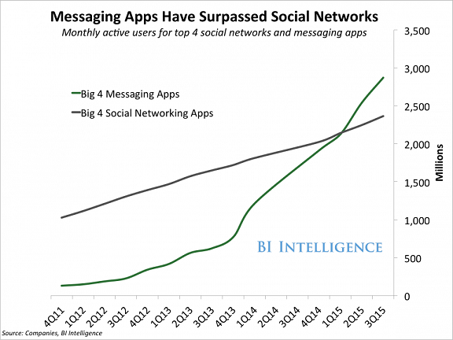
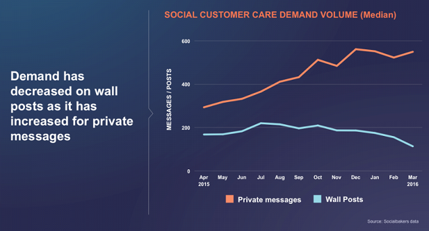
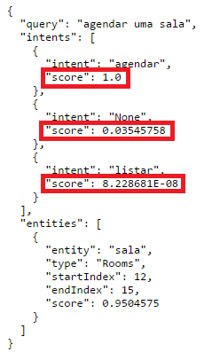
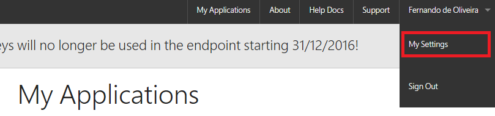
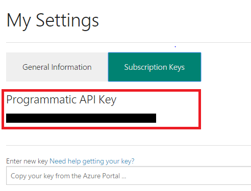
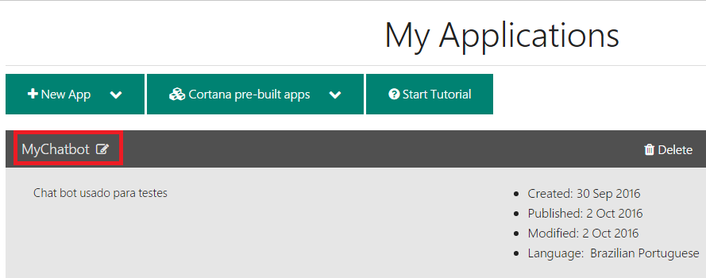
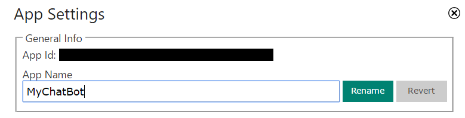
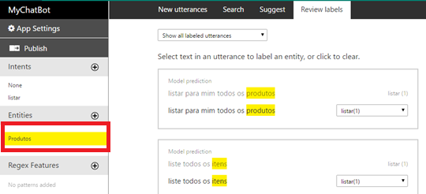
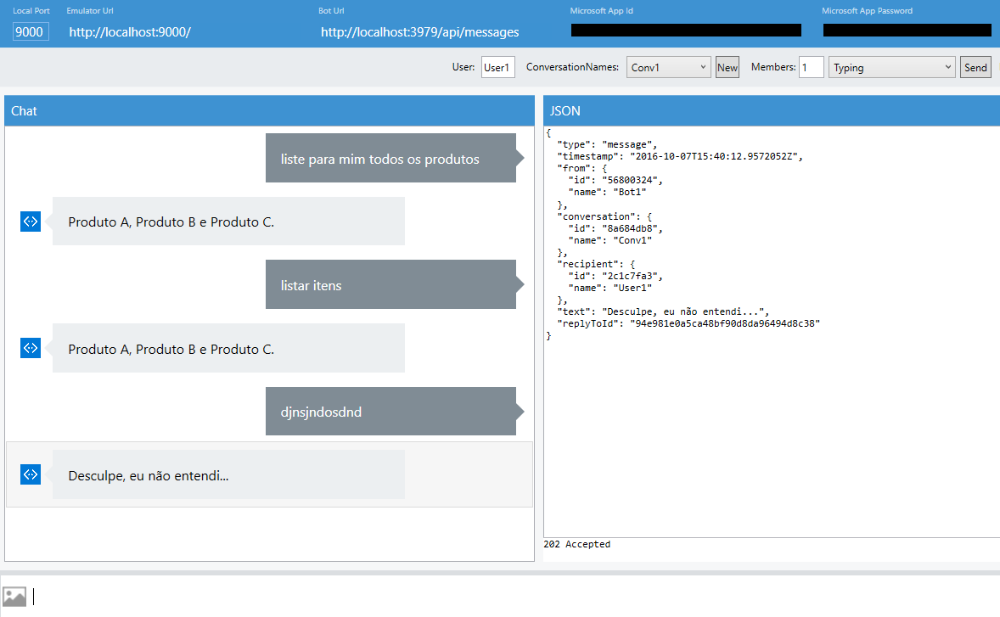

# Construindo Chat Bots com a plataforma Microsoft Bot Framework

Olá pessoal, meu nome é Fernando de Oliveira e neste artigo irei abordar o conceito de chat bots e mostrar como podemos desenvolver aplicações inteligentes para interagir com usuários de forma mais natural e humana. 

# O que é um chat bot?

Um chat bot é um programa que interage com usuários, simulando o comportamento humano em uma conversação (reagindo à comandos, perguntas e respostas). 

Um dos grandes desafios de um chat bot é ser um assistente para o usuário com conversações de forma mais natural possível, resolvendo tarefas de forma simples e eficiente.

A imagem abaixo mostra um exemplo de um chat bot no Skype:


# O impacto nas redes sociais

O número de usuários ativos em aplicativos de mensagens (como Skype, Slack, WhatsApp e Facebook Messenger) tem ultrapassado o número de usuários de redes sociais.

 

Um estudo feito para o Facebook mostrou que a demanda de mensagens privadas tem sido muito superior em relação à demanda de posts. Ou seja, usuários estão interagindo mais através do aplicativo de mensagens do que dentro da própria rede social.

 

Alta demanda por aplicativos de mensagens e volume de usuários crescendo cada vez mais. Ótimo momento para pensarmos em chat bots focados em negócios, não é mesmo? :)

# Apresentando o LUIS

Luis é um colega meu que está aprendendo inglês. Ele tem aprendido algumas palavras, frases e contextos, além de estar entendendo algumas perguntas e sabendo respondê-las. Quanto mais ele estuda, mais eu percebo sua evolução em uma conversação.

O LUIS que estarei apresentando agora não é o meu colega, mas o que ele faz é muito semelhante. LUIS - [Language Understanding Intelligent Service](https://www.microsoft.com/cognitive-services/en-us/language-understanding-intelligent-service-luis) - é uma API de Machine Learning que permite adicionar processamento de linguagem natural em aplicações, entendendo e interpretando linguagens contextualmente. É uma das APIs presentes no [Microsoft Cognitive Services](https://www.microsoft.com/cognitive-services).

Na página inicial do LUIS, é possível testar o funcionamento do serviço e visualizar a forma com que o resultado é gerado (em formato JSON). 

 

**Intenções** (ou **Intents**) no LUIS são ações específicas desejadas para cada aplicação. Na imagem acima por exemplo, algumas intenções são: ligar e desligar todas as luzes, ligar a luz da esquerda e ligar a luz da direita.

O LUIS analisa o contexto de cada frase e gera uma pontuação (**score**) para cada intenção criada pelo usuário. Imagine uma pontuação como algo que expressa quão confiante o LUIS está em identificar uma intenção como a ideal. 

A intenção que possuir a maior pontuação é a que tem a maior probabilidade de combinação com a frase. Como mostrado na imagem abaixo, a frase *“agendar uma sala”* tem maior probabilidade de combinação com a intenção *“agendar”*, pois possui maior pontuação.

 

Uma **Entidade** (ou **Entity**) é um conjunto de palavras-chave que o LUIS vai buscar dentro do contexto de uma frase que o usuário digita. Dentro de uma intenção podem ter várias entidades.

Como exemplo, imagine uma entidade chamada *“animal”*. Essa entidade pode englobar palavras como* “cachorro”*, *“gato”*, *“papagaio”*, etc. Quando um usuário digitar uma frase em que essas palavras estiverem dentro de um contexto (como *“quero informações sobre meu cachorro”*), o LUIS identificará que a palavra pertence ao conjunto *“animal”*.

O LUIS permite criar modelos customizados de compreensão de linguagem, permitindo que as aplicações entendam comandos específicos de acordo com a necessidade. No caso da imagem abaixo, um modelo foi criado para duas situações: agendamento de salas e listagem de produtos. Desta forma, a aplicação entenderá apenas comandos para estas situações.

 

Com essa visão geral sobre o LUIS podemos agora seguir com a visão geral do Microsoft Bot Framework REST API, que permitirá a integração do LUIS dentro da plataforma Bot Framework.

# Apresentando o Microsoft Bot Framework

O Microsoft Bot Framework é uma plataforma para desenvolvimento de bots. Fornece tudo o que é necessário para construir, conectar, gerenciar e publicar bots. Além disso, permite a comunicação com diversos canais (Skype, Slack, Facebook Messenger, Web Chat, entre outros), através de um serviço chamado Bot Connector.

O Bot Framework é separado basicamente em três componentes: Bot Builder SDK, Developer Portal e Bot Directory.

### Bot Builder SDK
É um kit de desenvolvimento open source disponível no [GitHub](https://github.com/Microsoft/BotBuilder) que oferece todos os recursos necessários para construção de diálogos. Você pode construir seu bot com a plataforma .NET ou Node.js.

O Bot Builder permite criar diversos tipos de interações: uso de imagens, cards, vídeos, áudios, documentos, chamadas (quando a plataforma permite, como o Skype), entre outros. 

Além disso é posível usar um emulador de chat para testes da aplicação, sem a necessidade de fazer deploy em produção constantemente. Por padrão o SDK já vem com uma extensão para integrar com o LUIS com seu bot.

### Developer Portal
O portal do [Bot Framework](dev.botframework.com) para desenvolvedores permite registrar seu bot, conectá-lo a vários canais (como Skype, Slack, Telegram e Facebook Messenger), testar conexão, publicar e gerenciar bots.

Por padrão, ao criar seu bot ele já estará configurado para funcionar no Skype e por WebChat. Caso você queira incluir seu bot em outro canal, como o Slack por exemplo, basta incluí-lo na sua lista de canais e configurar de acordo com um passo a passo que o portal oferece.

Basta registrar o bot, configurar canais e publicar seu projeto. Ao publicar, o Bot Framework vai atualizar todos os canais que você escolheu, automaticamente. Muito simples! :)

### Bot Directory
O Bot Directory é um diretório público para todos os bots registrados e publicados no Developer Portal. Com esse diretório, os usuários poderão encontrar e adicionar seus bots para incluir em seus aplicativos de mensagens.

Você não precisa expor seu bot publicamente. Caso você necessite que o bot seja para uso restrito, o Developer Portal oferece botões para que você possa copiar a URL do seu bot e distribuir para quem precisa de acesso.

 

# Preparando seu ambiente: Pré-requisitos

Antes de iniciarmos o desenvolvimento do chat bot, assumiremos os seguintes pré requisitos:

* Criar um novo projeto em C# e registrar um bot, usando o Bot Framework Connector SDK .NET template. Para mais detalhes de como criar o projeto, você pode ver o tutorial [Getting started in .NET](https://docs.botframework.com/en-us/csharp/builder/sdkreference/gettingstarted.html).
* Criar uma aplicação LUIS com cenário de uso para Bot e treiná-la com palavras e ações que você deseja para o seu projeto. Você pode encontrar um tutorial completo [aqui](https://www.luis.ai/Help). 

# Integrando o LUIS com o chat bot

Antes de iniciar a integração, será necessário obter os dados de duas chaves: **App Id** da aplicação LUIS e sua **Subscription Key**. Entre na página inicial do LUIS (https://www.luis.ai) e selecione **My Settings**. 

 

Após entrar nas configurações, selecione a aba **Subscription Keys** e copie a **Programmatic API Key**.

 

Volte para a página inicial do LUIS (https://www.luis.ai) e selecione sua aplicação com cenário e uso para Bot.

 

Após entrar na página inicial da aplicação, clique em **App Settings**, no canto superior esquerdo da página e copie o **App Id**.

 

Em seu projeto no Visual Studio não esqueça de configurar as chaves **MicrosoftAppId** e **MicrosoftAppPassword** no arquivo *Web.config*, geradas no momento de criação do bot no portal do Bot Framework.

```xml
<appSettings>
    <!-- update these with your BotId, Microsoft App Id and your Microsoft App Password-->
    <add key="BotId" value="YourBotId" />
    <add key="MicrosoftAppId" value="YourAppIdHere" />
    <add key="MicrosoftAppPassword" value="YourAppPasswordHere" />
</appSettings>
```

Crie uma nova classe em seu projeto chamada *RootLuisDialog.cs* que utiliza uma interface de diálogo específica para o LUIS.

```c#
[LuisModel("Your App Id here", "Your subscription key here")]
[Serializable]
public class RootLuisDialog : LuisDialog<object>
{
    [LuisIntent("None")]
    public async Task NoneAsync(IDialogContext context, LuisResult result)
    {
        await context.PostAsync("Desculpe, eu não entendi...");
	context.Wait(MessageReceived);
    }
}
```

No atributo **LuisModel**, você deve definir o App Id da sua aplicação LUIS e sua subscription key, como mostrado anteriormente. As duas chaves que você copiou devem ser usadas neste atributo.

Uma Intent (ou intenção), como mostrado anteriormente, é uma definição de uma ação que você deseja. Por exemplo, dentro da nossa aplicação *MyChatBot*, foi criado uma intenção chamada *“listar”*. Esta intenção tem como objetivo listar todos os itens.

 

No atributo **LuisIntent** da classe *RootLuisDialog.cs*, você define sua Intent criada na sua aplicação LUIS. Para cada Intent, você define uma Task assíncrona. Quando o usuário digita um texto, o LUIS determina qual Intent esse texto mais se aproxima e redireciona para a sua Task e executa. Neste caso, iremos criar uma Task para a Intent *“listar”*.

```c#
[LuisIntent("listar")]
public async Task ListarAsync(IDialogContext context, LuisResult result)
{
     await context.PostAsync("Produto A, Produto B e Produto C."); 
     context.Wait(MessageReceived);
}
```

Dentro da classe *MessagesController.cs*, que é criada automaticamente quando você cria uma nova aplicação Bot, iremos chamar a classe *RootLuisDialog* que terminamos de criar.

```c#
[BotAuthentication]
public class MessagesController : ApiController
{
    public async Task<HttpResponseMessage> Post([FromBody]Activity activity)
    {
        if (activity.Type == ActivityTypes.Message)
        {
            await Conversation.SendAsync(activity, () => new RootLuisDialog());
        }
        else
        {
            HandleSystemMessage(activity);
        }

        var response = Request.CreateResponse(HttpStatusCode.OK);
        return response;
    }

    private static void HandleSystemMessage(IActivity message)
    {
        if (message.Type == ActivityTypes.DeleteUserData)
        {
            // Implement user deletion here
            // If we handle user deletion, return a real message
        }
        else if (message.Type == ActivityTypes.ConversationUpdate)
        {
            // Handle conversation state changes, like members being added and removed
            // Use Activity.MembersAdded and Activity.MembersRemoved and Activity.Action for info
            // Not available in all channels
        }
        else if (message.Type == ActivityTypes.ContactRelationUpdate)
        {
            // Handle add/remove from contact lists
            // Activity.From + Activity.Action represent what happened
        }
        else if (message.Type == ActivityTypes.Typing)
        {
            // Handle knowing tha the user is typing
        }
        else if (message.Type == ActivityTypes.Ping)
        {
        }
    }
}
```

Após feita a mudança na Task Post, rode o projeto e abra o Microsoft Bot Framework Channel Emulator. Para configurar o emulador com seu projeto local, você pode ver [aqui](https://docs.botframework.com/en-us/csharp/builder/sdkreference/gettingstarted.html#emulator). 

Se você quiser usar o emulador para testar com seu ambiente na nuvem, você pode acessar o link [Bot Framework Emulator](https://docs.botframework.com/en-us/tools/bot-framework-emulator/).

 

Desta forma já podemos ver o chat bot integrado com a aplicação LUIS. Quanto mais sentenças você treinar com o LUIS, mais natural será a interação do seu chat bot com os usuários. Após publicar sua aplicação na nuvem e incluir seu bot para canais como o Skype no portal do Bot Framework, você já poderá ver seu chat bot funcionando em ambiente de produção.

# Considerações Finais

Como podemos ver, a implementação de um bot com processamento de linguagem natural é relativamente simples. Esta integração nos abre uma grande possibilidade de automatização de processos e novos modelos de negócios.

Porém, é importante tomar cuidado: chat bots não vieram para resolver todos os problemas! É sempre importante analisar cada situação e identificar se o chat bot trará valor para o seu caso ou não.

Use, mas não abuse de processamento de linguagem natural. Vale ressaltar que o método não é 100% garantido em compreensão de contextos, o que pode gerar alguns resultados incorretos. Para melhorar a experiência do usuário e evitar este tipo de problema, use a linguagem natural junto com outros elementos que o Bot Framework oferece: Imagens, botões, formulários, etc. Desta forma você está guiando o usuário para um objetivo e mantendo a fluidez de uma conversação.

# Referências

Para mais informações sobre o funcionamento do Bot Framework e do LUIS, você pode acessar estes links:
* [Bot Framework Documentation](https://docs.botframework.com/en-us/)
* [LUIS Documentation](https://www.microsoft.com/cognitive-services/en-us/documentation)
* [Build BOT with Microsoft Bot Framework Rest API](http://www.codeproject.com/Articles/1129036/Build-BOT-with-Microsoft-Bot-Framework-Rest-API)

# Sobre o Autor
Fernando de Oliveira (https://github.com/fernandobrs) é estagiário na Microsoft e estudante de Engenharia da Computação. Atualmente está desenvolvendo um livro digital focado em melhores práticas para bots ([UX Best Practices for Bot applications](https://aka.ms/ux-chatbots)).